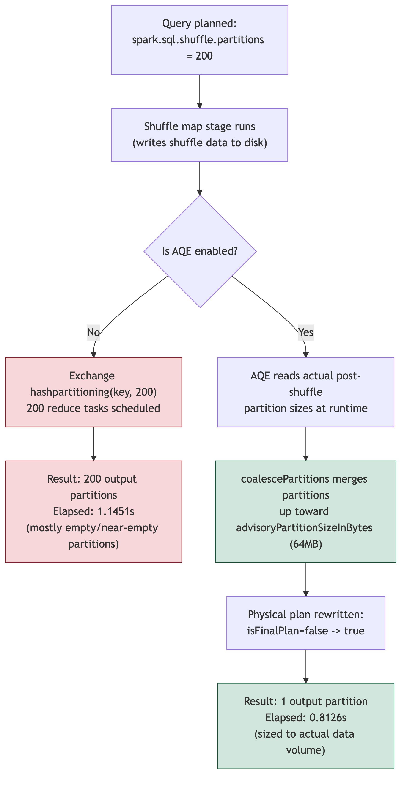

# The "200 Partitions" Myth: Why Adaptive Query Execution Changes Everything You Thought You Knew About Spark Shuffle Tuning

> This article is also published on Medium: [The "200 Partitions" Myth in Spark](https://herley-shaori.medium.com/thread-the-200-partitions-myth-in-spark-4b2f0ee86f9d)

## Introduction

Almost every Spark practitioner has, at some point, copy-pasted `spark.sql.shuffle.partitions=200` into a cluster configuration without questioning why. The number has become folklore: a default so widely repeated that it is rarely re-examined, even as Spark itself has evolved past the assumptions that produced it. This article dismantles that assumption empirically, using small, reproducible datasets and real execution evidence, and shows how Adaptive Query Execution (AQE) has quietly rewritten the rules of shuffle partition tuning.

The intended audience is senior data engineers and architects who are comfortable with Spark's internals but may not have revisited this specific default since AQE became standard in Spark 3.x.

## A Brief History of `spark.sql.shuffle.partitions`

The default value of 200 for `spark.sql.shuffle.partitions` [4] originates from Spark's pre-AQE era, when the number of post-shuffle partitions was fixed at planning time and could not be adjusted based on actual runtime data volume. In that era, 200 was a reasonable general-purpose compromise: large enough to parallelize workloads across a modestly sized cluster, small enough to avoid excessive task scheduling overhead for the shuffle workloads common at the time.

The problem is that this value is static. It is chosen once, at query planning time, regardless of whether the underlying data is a few kilobytes or several terabytes. On a small dataset, this produces a very specific and measurable inefficiency: hundreds of tiny, near-empty partitions, each requiring its own task to be scheduled, launched, and torn down, dwarfing the actual work being done [1].

## Experiment 1: Debunking the "200 Partitions" Myth

### Setup

The experiment uses Apache Spark 3.5.1, run via Docker (`apache/spark:3.5.1-python3`), executed directly from the CLI using `spark-submit`. The dataset is deliberately small: 5,000 rows generated with `spark.range()`, grouped into only 10 distinct keys, with a `sum` and `count` aggregation forcing a shuffle.

```python
df = spark.range(0, 5000).withColumn("key", (F.col("id") % 10)).withColumn("value", F.col("id") * 2)
agg = df.groupBy("key").agg(F.sum("value").alias("total"), F.count("*").alias("cnt"))
```

AQE is explicitly disabled for this run:

```python
spark.sql.adaptive.enabled=false
spark.sql.shuffle.partitions=200
```

The full, runnable script (`experiment.py`) is included alongside this article. Both experiments below were produced by running it directly:

```
docker pull apache/spark:3.5.1-python3
docker run --rm -v "$(pwd)":/work apache/spark:3.5.1-python3 /opt/spark/bin/spark-submit /work/experiment.py false
docker run --rm -v "$(pwd)":/work apache/spark:3.5.1-python3 /opt/spark/bin/spark-submit /work/experiment.py true
```

### Evidence

The physical plan produced by `.explain(True)` shows the shuffle exchange is planned with exactly 200 partitions, regardless of the fact that the aggregation only produces 10 output rows:

```
== Physical Plan ==
*(2) HashAggregate(keys=[key#2L], functions=[sum(value#5L), count(1)], output=[key#2L, total#13L, cnt#15L])
+- Exchange hashpartitioning(key#2L, 200), ENSURE_REQUIREMENTS, [plan_id=17]
   +- *(1) HashAggregate(keys=[key#2L], functions=[partial_sum(value#5L), partial_count(1)], output=[key#2L, sum#21L, count#22L])
      +- *(1) Project [(id#0L % 10) AS key#2L, (id#0L * 2) AS value#5L]
         +- *(1) Range (0, 5000, step=1, splits=14)
```

Measured metrics for this run:

| Metric | Value |
|---|---|
| Output partitions after shuffle | 200 |
| Elapsed time | 1.1451s |

Nearly all of those 200 partitions are empty or contain a single key's worth of data. Every one of them still requires the Spark scheduler to allocate a task, track its lifecycle, and report it back to the driver. For a dataset this size, that overhead is not a rounding error, it is the majority of the work being done.

## Experiment 2: Before/After AQE Coalesce

### Setup

The identical job is re-run with AQE and its partition-coalescing behavior enabled:

```python
spark.sql.adaptive.enabled=true
spark.sql.adaptive.coalescePartitions.enabled=true
spark.sql.shuffle.partitions=200
```

### Evidence

The physical plan initially looks nearly identical, wrapped in an `AdaptiveSparkPlan`:

```
== Physical Plan ==
AdaptiveSparkPlan isFinalPlan=false
+- HashAggregate(keys=[key#2L], functions=[sum(value#5L), count(1)], output=[key#2L, total#13L, cnt#15L])
   +- Exchange hashpartitioning(key#2L, 200), ENSURE_REQUIREMENTS, [plan_id=15]
      +- HashAggregate(keys=[key#2L], functions=[partial_sum(value#5L), partial_count(1)], output=[key#2L, sum#21L, count#22L])
         +- Project [(id#0L % 10) AS key#2L, (id#0L * 2) AS value#5L]
            +- Range (0, 5000, step=1, splits=14)
```

The key detail is `isFinalPlan=false`: this is the plan Spark starts with, not the plan it finishes with. Once the shuffle map stage completes, AQE inspects the actual size of the shuffled data and rewrites the plan before execution continues [2][3]. The measured result after execution:

| Metric | Without AQE | With AQE |
|---|---|---|
| Output partitions after shuffle | 200 | 1 |
| Elapsed time | 1.1451s | 0.8126s |

AQE collapsed 200 planned partitions down to a single final partition, because the actual post-shuffle data size for this workload does not warrant more. The result set is identical; the execution path is not.

The diagram below summarizes both execution paths side by side, from query planning through to the final measured result:



*Figure 1: Both runs start from the same plan, `spark.sql.shuffle.partitions=200`, and the same shuffle map stage. Without AQE (left path), Spark commits to the `Exchange hashpartitioning(key, 200)` step and schedules 200 reduce tasks regardless of actual data volume. With AQE (right path), the coalescing logic reads the real post-shuffle partition sizes at runtime, merges them toward the `advisoryPartitionSizeInBytes` target of 64MB, and rewrites the physical plan from `isFinalPlan=false` to `isFinalPlan=true` before the reduce stage runs. The two paths diverge only after the "Is AQE enabled?" decision, but that single decision is what separates 200 scheduled tasks from 1.*

## Analysis: What Is Actually Happening

AQE's partition coalescing is governed by two configuration parameters that are rarely discussed outside of Spark's internals documentation:

- **`spark.sql.adaptive.coalescePartitions.enabled`**: turns on the coalescing behavior itself. This is enabled by default alongside `spark.sql.adaptive.enabled` in Spark 3.x, meaning most users are already benefiting from this without realizing it [2].
- **`spark.sql.adaptive.advisoryPartitionSizeInBytes`**: the target size AQE aims for when merging small post-shuffle partitions. The default is 64MB. AQE greedily merges adjacent small partitions until this target is approached, rather than blindly using whatever number `spark.sql.shuffle.partitions` specifies [2].
- **`spark.sql.adaptive.coalescePartitions.minPartitionSize`**: a floor that prevents over-aggressive coalescing when the advisory size would otherwise produce partitions that are too few for available parallelism [2].

In other words, `spark.sql.shuffle.partitions=200` under AQE is no longer "the number of partitions the job will use." It is closer to "the maximum number of partitions AQE will consider before deciding how many are actually needed." This distinction has substantial implications: tuning this value upward to "be safe" no longer directly translates into more parallelism, and tuning it downward no longer risks starving a large job, because AQE can only coalesce, it does not split.

This also clarifies when AQE is not enough. AQE coalescing operates on partition size, not on the number of distinct keys or the semantic shape of the data. Highly skewed joins, where one key dominates the shuffle, are a separate problem addressed by `spark.sql.adaptive.skewJoin.enabled` and its associated thresholds, not by coalescing [2]. Coalescing alone will not fix a job where one partition is 100x larger than the rest, and manual intervention or skew-specific configuration is still warranted in those cases.

## Practical Checklist

| Scenario | Recommendation |
|---|---|
| Small datasets, modern Spark (3.x with AQE default-enabled) | Leave `spark.sql.shuffle.partitions` at its default. AQE will coalesce automatically; manual tuning has little effect. |
| Small cluster, AQE disabled for any reason | Lower `spark.sql.shuffle.partitions` explicitly to match expected parallelism; the static default will otherwise generate needless scheduling overhead. |
| Large datasets with skew | Enable and tune `spark.sql.adaptive.skewJoin.enabled` and its threshold parameters. Coalescing will not resolve skew on its own. |
| Investigating unexpected shuffle behavior | Always inspect `.explain(True)` for `isFinalPlan` status, and compare it against actual post-execution partition counts. The pre-execution plan under AQE is not the final story. |

## References & Documentation

[1] Apache Spark SQL Performance Tuning Guide. https://spark.apache.org/docs/latest/sql-performance-tuning.html

[2] Adaptive Query Execution (Spark SQL Guide). https://spark.apache.org/docs/latest/sql-performance-tuning.html#adaptive-query-execution

[3] SPIP: Adaptive Query Execution (original design proposal). https://issues.apache.org/jira/browse/SPARK-23128

[4] Spark Configuration Reference. https://spark.apache.org/docs/latest/configuration.html
